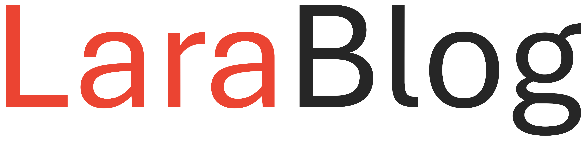

# LaraBlog

LaraBlog is a simple blog application built with Laravel 11, TailwindCSS, JQuery, and vanilla JavaScript.

Visit [LaraBlog](https://larablog.sajidifti.com) for a live demo. Or go to [larablog.sajidifti.com](https://larablog.sajidifti.com).

Click [here](https://cloud.sajidifti.com/index.php/s/2pg2Za68kDZSgzM) to view a demonstration video.

## Technologies/Libraries

- Laravel 11
- TailwindCSS
- JQuery
- JavaScript
- PHP
- SQLite3
- FlowBite
- Tw-Elements
- Toastr
- Flasher
- SweetAlert2
- TinyMCE

## Installation

1. Clone the repository
2. Install the dependencies
3. Run the application

## Features

1. Create a new post
2. Edit the post
3. Delete the post
4. View the post details
5. View all posts
6. View category posts
7. Update profile
8. Login
9. Register
10. Logout
11. Admin dashboard
